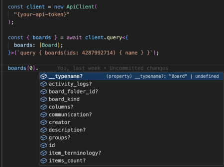

# Monday GraphQL JS SDK

## Introduction

The monday api SDK provides a simple way to interact with monday.com's GraphQL platform API, making it easier than ever to get started with our API.
The SDK abstracts away the complex GraphQL queries, providing simple operations for the most common endpoints such as fetching board data, or creating items.

The SDK is supported in both Node.js and browser environments, and is using the [graphql-request client](https://www.npmjs.com/package/graphql-request) under the hood.

Want to make more complex queries or find out more about what our API has to offer, check out [monday.com's API documentation](https://developer.monday.com/api-reference).

If your code operates within a browser-based app deployed on monday.com, you can utilize the **SeamlessApiClient** class which does not require specifying the user's token. For all other scenarios, use the **ApiClient** class.

## Installation

```bash
npm install @mondaydotcomorg/api
```

## Important

All exported types correspond to the current version of the API that existed when the NPM package was released

For the conviniecne of monday app developers, this CLI is included in the [@mondaydotcomorg/apps-cli](https://www.npmjs.com/package/@mondaycom/apps-cli).
If you want to use it on it’s own, you can install [@mondaydotcomorg/setup-api](https://www.npmjs.com/package/@mondaydotcomorg/setup-api).
(you can find more about app development here [monday-apps-sdk](https://developer.monday.com/apps/docs/introduction-to-the-sdk))

## Usage

### Using the api client

The package exports the class `ApiClient` which is the main entry point to the SDK. You can use it to query monday's API freestyle, or use the operations provided by the SDK.

```typescript
import { ApiClient } from '@mondaydotcomorg/api';

const client = new ApiClient('<API-TOKEN>');

// Or use the operations provided by the SDK
const me = await client.operations.getMeOp();

// Example how to change a text column
const changeTextColumn = await client.operations.changeColumnValueOp({
    boardId: "your_board_id",
    itemId: "your_item_id",
    columnId: "text",
    value: JSON.stringify("Hello, world!"),
});

// Example how to change a status column
const changeStatusColumn = await client.operations.changeColumnValueOp({
    boardId: "your_board_id",
    itemId: "your_item_id",
    columnId: "project_status", // replace with your column id
    value: JSON.stringify({ label: "Done" }),
});

// Use the client to query monday's API freestyle WITHOUT TYPES -> Use @mondaydotcomorg/setup-api to setup typed project!
const boards = await client.query<{boards: [{ name: string }]}>(`query { boards(ids: some_id) { name } }`);

// You can also use the types provided by the sdk 
const { boards } = await client.query<{
  boards: [Board];
}>(`query { boards(ids: some_id) { name } }`);
```

### Using the types

The package exports all the types used by the SDK, so you can use them in your code.

```typescript
import { User } from '@mondaydotcomorg/api';

const user: User = {
    id: '123',
    name: 'John Doe',
    email: 'john.doe@someorg.com'
}
```

## SeamlessApiClient

The SeamlessApiClient class is a tool designed for making seamless API requests to Monday.com, tailored for use within the client side of applications deployed on the platform.
Basically, when you are making an api call from the client side of an app deployed on Monday.com, you dont need to specify the users token.

```typescript
import {
  Board,
} from "@mondaycom/api";

const { boards } = await SeamlessApiClient.query<{boards: [Board];}>(`query { boards(ids: some_id) { id name } }`);

// or using your own types after integrating with @mondaycom/setup-api
import { GetBoardsQueryVariables, GetBoardsQuery } from "./generated/graphql";
const variables: GetBoardsQueryVariables = { ids: ["some_id"] };

export const getBoards = gql`
  query GetBoards($ids: [ID!]) {
    boards(ids: $ids) {
      id
      name
    }
  }
`;

const data = await SeamlessApiClient.query<GetBoardsQuery>(getBoards, variables);
```

### Type support

note that after usage, you'l get all the available fields, with no regard to the fields you asked for



**But there's a solution, look [here!](https://www.npmjs.com/package/@mondaydotcomorg/setup-api)**
